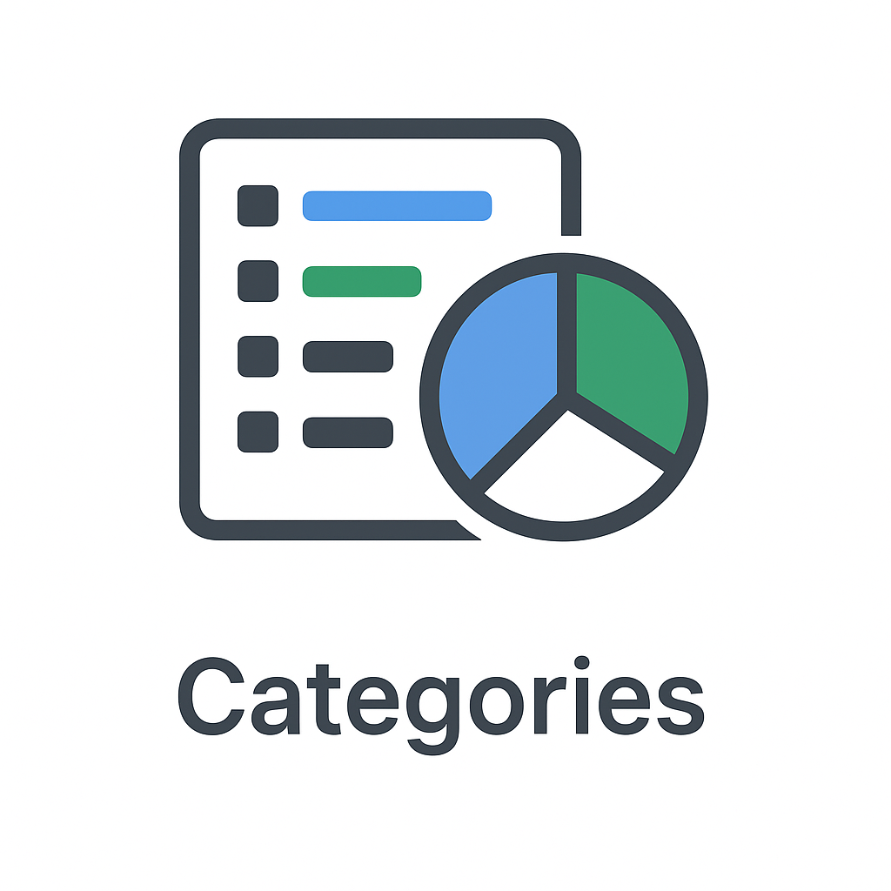
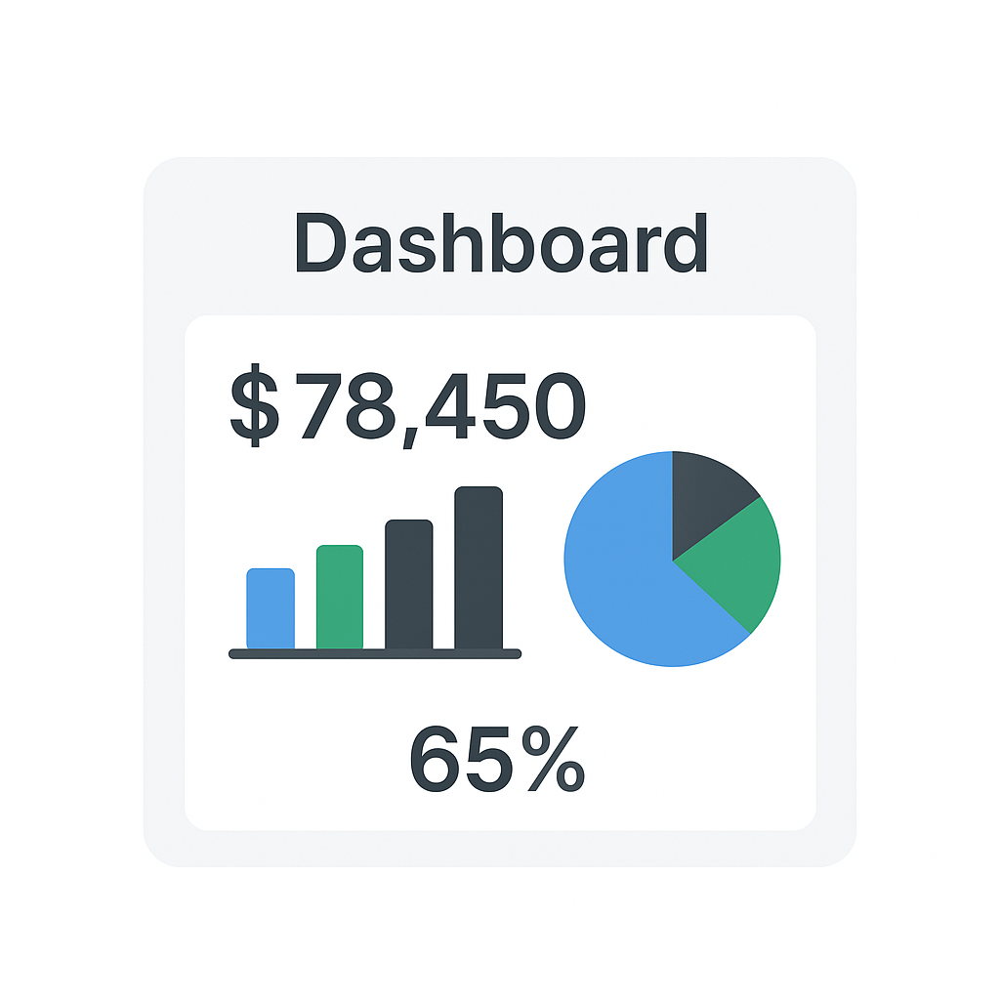

# UPI Spend Tracker - Landing Page

This is a simple **landing page** for the upcoming **UPI Spend Tracker App**.  
The app helps users track their UPI transactions, categorize expenses, and analyze spending with clean dashboards.

## 🌟 Features
- 📷 **Hero Section** – Highlights the app’s purpose
- 💳 **Features Showcase** – Scan QR, categorize transactions, and view analytics
- 📊 **Dashboard Preview** – Displays spending insights
- 📩 **Contact Form** – Allows users to reach out via email
- 🎨 **Modern UI** – Clean, minimal, and responsive

## 🖼️ Screenshots
### QR Scan


### Categories


### Dashboard


## 🚀 How to Run Locally
1. Clone this repo:
   ```bash
   git clone https://github.com/yourusername/upi-spend-tracker.git
